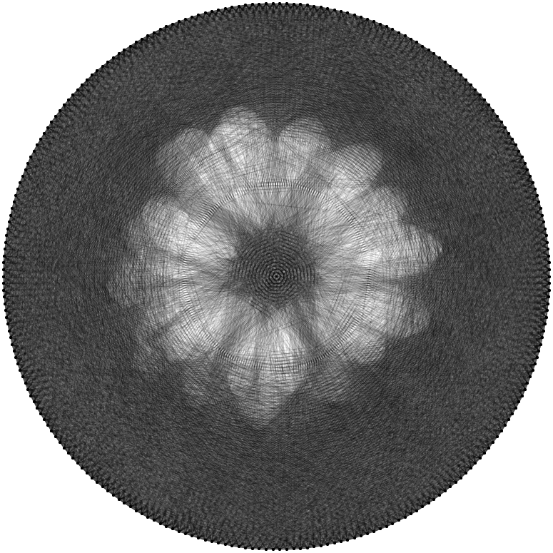
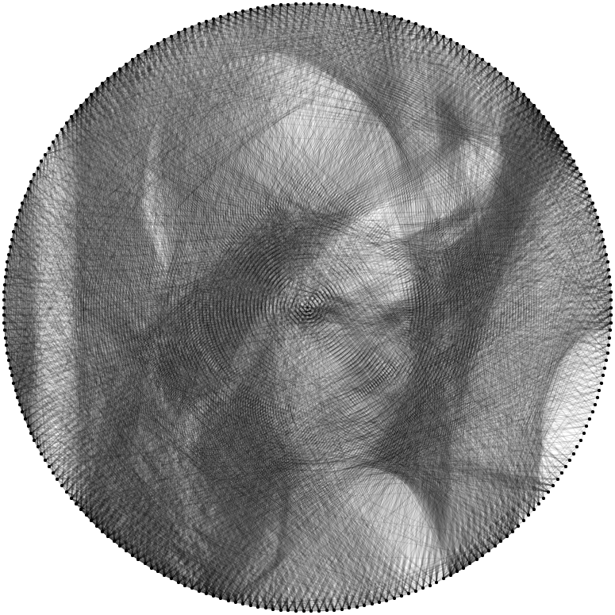
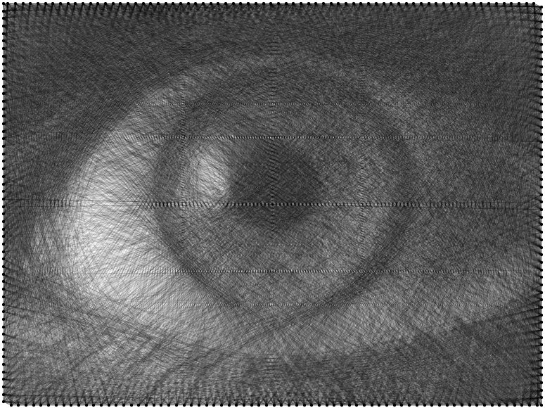
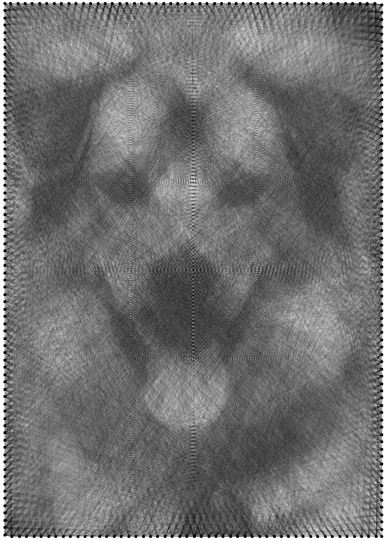

# StringArtGenerator
Генератор изображений в стиле StringArt

## Что умеет генератор

* превращать произвольные изображения в изображения в стиле string art;
* сохранять результат работы в виде png и svg изображений, а также в специальном stringart формате.

Генератор позволяет изменить некоторые параметры входного изображения для создания наиболее качественного рисунка:

* яркость;
* контрастность;
* инверсия яркости.

Настройки генерируемого арта:

* количество гвоздей – чем больше, чем точнее и качественнее может получиться арт
* количество линий – влияет на детализацию получаемого изображения
* непрозрачность линий – позволяет воссоздавать оттенки за счёт наложения нескольких линий с прозрачностью
* цвет линий и фона – на случай, если захочется добавить в арт красок

## Как работает генератор

* выбирается начальный гвоздь, после чего необходимо выбрать гвоздь, в который провести линию;
* среди всех возможных линий подсчитывается средняя яркость пикселей исходного изображения;
* выбирается линия, имеющая наименьшую яркость.
* проведённая линия "удаляется" из исходного изображения путём прибавления к значениям пикселей этой линии значения непрозрачности;
* следующим начальным гвоздём становится тот, что находится на конце добавленной линии и процесс начинается сначала.

### Про непрозрачность
Если непрозрачность равна 100%, то за одну линию все соответствующие пиксели исходного изображения станут белыми, а получаемая картинка очень быстро превратится в сплошную залитую фигуру. Таким образом использование прозрачности позволяет создавать оттенки.

## Примеры работы

<table>
    <tr>
        <td></td>
        <td></td>
    </tr>
    <tr>
        <td></td>
        <td></td>
    </tr>
</table>
